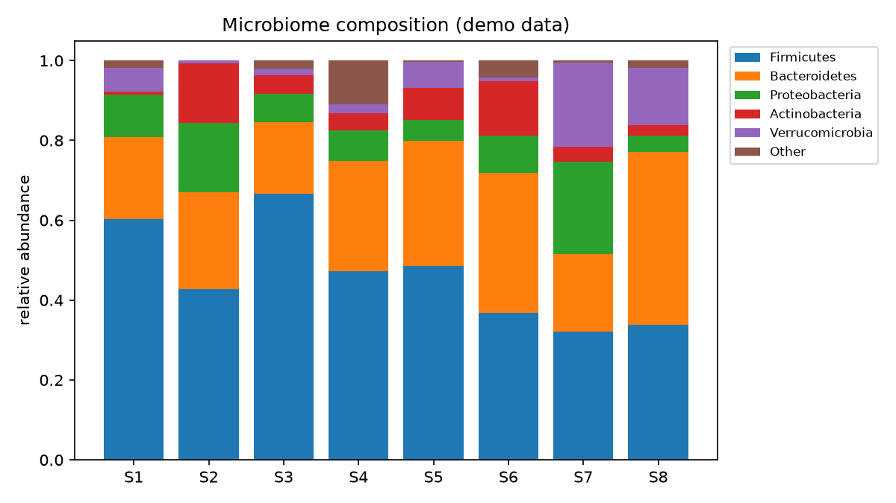

# Microbiome Taxa Barplot

You cannot count every microbe in a gut sample — but you can see who dominates and how it shifts between people. The stacked bar plot is the microbiome field's signature view.

## Why This Matters

16S and metagenomic studies produce relative abundances: what fraction of each sample belongs to each taxon. A stacked bar plot per sample makes composition and its variation immediately legible — the Firmicutes-to-Bacteroidetes balance, blooms of Proteobacteria (often a dysbiosis flag), and sample-to-sample differences that motivate the statistics.

## How It Works

1. Normalise each sample's counts to relative abundance.
2. Stack the taxa within each sample's bar.
3. Compare composition across samples.

## What the Demo Shows



The demo simulates eight samples from a realistic gut-like distribution. Each bar is a full community, and you can read the dominant phyla and how their balance varies between samples — the first look in any microbiome analysis.

## Run It

```bash
pip install -r requirements.txt
python demo.py
```

> Demonstrated on synthetic data, so it's fully reproducible with no external downloads.
